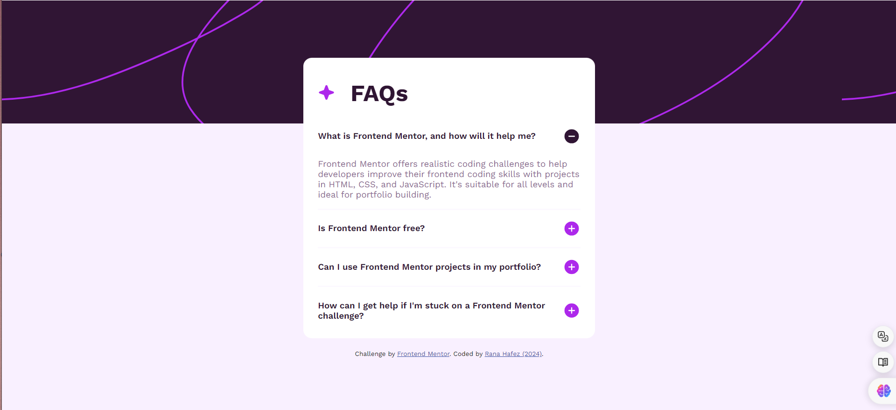

# Frontend Mentor - FAQ accordion solution

This is a solution to the [FAQ accordion challenge on Frontend Mentor](https://www.frontendmentor.io/challenges/faq-accordion-wyfFdeBwBz). Frontend Mentor challenges help you improve your coding skills by building realistic projects.

## Table of contents

- [Overview](#overview)
  - [The challenge](#the-challenge)
  - [Screenshot](#screenshot)
  - [Links](#links)
- [My process](#my-process)
  - [Built with](#built-with)
  - [What I learned](#what-i-learned)
- [Author](#author)
- [Acknowledgments](#acknowledgments)

**Note: Delete this note and update the table of contents based on what sections you keep.**

## Overview

### The challenge

Users should be able to:

- Hide/Show the answer to a question when the question is clicked
- Navigate the questions and hide/show answers using keyboard navigation alone
- View the optimal layout for the interface depending on their device's screen size
- See hover and focus states for all interactive elements on the page

### Screenshot



### Links

- Solution URL: [Add solution URL here](https://github.com/RanaHafez/Frontend-Mentor---FAQ-accordion-solution/tree/main)
- Live Site URL: [Add live site URL here](https://your-live-site-url.com)

## My process

### Built with

- Semantic HTML5 markup
- CSS custom properties
- Flexbox
- [React](https://reactjs.org/) - JS library
- [Next.js](https://nextjs.org/) - React framework

### What I learned

The main thing was to toggle the buttons using useState:

```js
const [isCollapsed, setIsCollapse] = useState(
  props.questionID === 1 ? false : true
);
function toggleCollapse() {
  setIsCollapse((prevState) => !prevState);
}
```

## Author

- Website - [My Portfolio](https://portofolio-8jzk.onrender.com/)
- Frontend Mentor - [@RanaHafez](https://www.frontendmentor.io/profile/RanaHafez)
- LinkedIn - [@ranahafez](https://www.linkedin.com/in/rana-hafez-a34315227/)

# Rana (2024)
